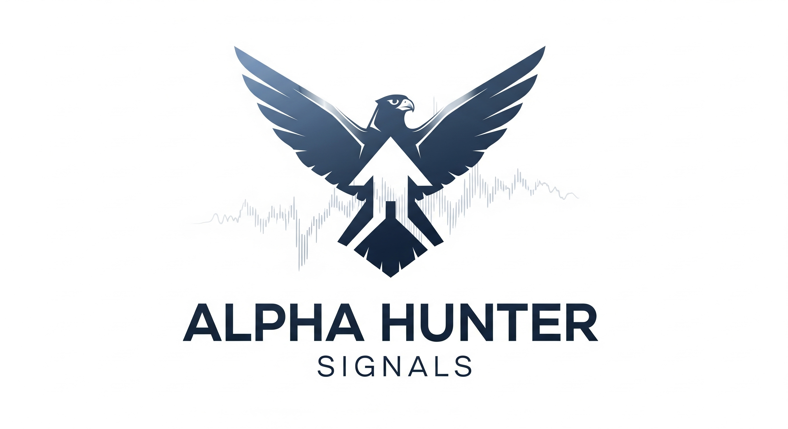

# Alpha Hunter Signals 🚀



**Created by Michael David Jaramillo**  
*AI-Powered Autonomous Options Trading Signal System*

[](https://opensource.org/licenses/MIT)
[](https://www.python.org/downloads/)
[](https://telegram.org/)

## 🎯 Overview

Alpha Hunter Signals is a sophisticated, AI-powered autonomous trading system that analyzes the S&P 500 in real-time to identify high-probability options trading opportunities. Built with a unified ecosystem approach, it combines multiple analysis engines to deliver professional-grade trading signals directly to Telegram.

### ✨ Key Features

- 🤖 **Fully Autonomous**: No manual intervention required
- 📊 **Multi-Dimensional Analysis**: Technical, Fundamental, Sentiment, ML, Quantum & Market Psychology
- 🎯 **Smart Options Strategies**: Focus on ITM/ATM options with realistic 7-14 day expiry
- 📱 **Dual Delivery**: Personal chat + Public channel for team sharing
- ⚡ **Real-Time Data**: Live market data integration with fallback systems
- 🛡️ **Risk Management**: Conservative take profit (3%) and stop loss (2.5%) targets
- 🔄 **Self-Healing**: Automatic error recovery and data source failover

## 🏗️ System Architecture

### Core Components

```
┌─────────────────────────────────────────────────────────┐
│                 Alpha Hunter Signals                    │
├─────────────────────────────────────────────────────────┤
│  📡 Unified Telegram Messenger (Dual Delivery)         │
├─────────────────────────────────────────────────────────┤
│  🧠 Unified Ecosystem Engine                           │
│  ├── Technical Analysis    ├── Sentiment Analysis       │
│  ├── Fundamental Analysis  ├── Machine Learning         │
│  ├── Market Psychology    └── Quantum Enhancement       │
├─────────────────────────────────────────────────────────┤
│  📊 Data Layer                                          │
│  ├── Enhanced Real-Time Scraper                        │
│  ├── Robust Data Sources (Yahoo, Alpha Vantage, etc.)  │
│  └── Intelligent API Controller                        │
├─────────────────────────────────────────────────────────┤
│  🎯 Strategy Layer                                      │
│  ├── Present Continuous Options Engine                 │
│  ├── Professional Trading Guide                        │
│  └── Risk Management System                            │
└─────────────────────────────────────────────────────────┘
```

### Analysis Pipeline

1. **Data Acquisition** → Real-time market data from multiple sources
2. **Multi-Analysis Processing** → 6 parallel analysis engines
3. **Probability Unification** → Weighted consensus algorithm
4. **Strategy Selection** → Optimal options strategy (long_call/long_put)
5. **Signal Generation** → Professional trading alert with specific parameters
6. **Dual Delivery** → Simultaneous delivery to personal + public channels

## 🚀 Quick Start

### Prerequisites

- Python 3.11+
- Telegram Bot Token
- Market Data API Keys (optional, has fallbacks)

### Installation

1. **Clone the repository**
```bash
git clone https://github.com/your-username/Alpha-Hunter-Signal.git
cd Alpha-Hunter-Signal
```

2. **Install dependencies**
```bash
pip install -r requirements.txt
```

3. **Configure environment variables**
```bash
cp .env.example .env
# Edit .env with your credentials
```

4. **Run the system**
```bash
python3 autonomous_sp500_scanner.py --test --tickers 5
```

## ⚙️ Configuration

### Environment Variables

Create a `.env` file in the root directory:

```env
# Telegram Configuration (Required)
TELEGRAM_BOT_TOKEN=your_bot_token_here
TELEGRAM_CHAT_ID=your_personal_chat_id
TELEGRAM_CHANNEL_ID=your_channel_id_for_signals

# Market Data APIs (Optional - has fallbacks)
ALPHA_VANTAGE_KEY=your_alpha_vantage_key
POLYGON_API_KEY=your_polygon_key
FINNHUB_API_KEY=your_finnhub_key

# Trading Platform (Optional)
ALPACA_API_KEY_ID=your_alpaca_key_id
ALPACA_SECRET_KEY=your_alpaca_secret_key
```

### System Parameters

The system can be customized via configuration files:

- `present_continuous_calibration.json` - Options strategy parameters
- `custom_ticker_config.py` - S&P 500 ticker selection
- Trading thresholds and risk management settings

## 📈 Signal Format

Alpha Hunter generates professional trading signals in this format:

```
🚀 ALPHA HUNTER - OPORTUNIDAD DETECTADA

📊 TICKER: SPY
💰 PRECIO: $638.11
🎯 DIRECCION: BULLISH
⚡ PROBABILIDAD: 65.0%
🔬 CONFIANZA DEL ECOSISTEMA: 82.5%

🔍 ANALISIS COMPONENTES:
📈 Technical: ALCISTA 70% (confianza: 85%)
💼 Fundamental: ALCISTA 65% (confianza: 80%)
📰 Sentiment: ALCISTA 60% (confianza: 75%)

🚀 ESTRATEGIA RECOMENDADA:
🎯 LONG CALL (1% OTM)
💰 Retorno esperado: 15.0%
⚖️ Riesgo: MEDIUM

📋 DETALLES OPERACIONALES:
🎯 LONG CALL (1% OTM) - Strike: $644.49 - Vence: 31/08
💰 Take Profit: $657.25 (+3%) | Stop Loss: $622.16 (-2.5%)

🧠 LÓGICA DE LA DECISIÓN:
💡 Confluencia alcista confirmada: técnico alcista, fundamentales sólido...

🔥 ALPHA HUNTER - AI ANALYSIS
🕐 14:30:15
🚀 Sistema automatizado activo
```

## 🔧 Advanced Features

### Multi-Dimensional Analysis

- **Technical Analysis**: RSI, MACD, Moving Averages, Bollinger Bands, Volume
- **Fundamental Analysis**: P/E ratios, Book value, Debt ratios, Growth metrics
- **Sentiment Analysis**: News sentiment, Social media, Analyst ratings
- **Machine Learning**: LSTM, Random Forest, Gradient Boosting predictions
- **Quantum Enhancement**: Superposition analysis, Coherence factors
- **Market Psychology**: Fear/Greed index, VIX levels, Crowd behavior

### Risk Management

- **Conservative Targets**: 3% take profit, 2.5% stop loss
- **Short-Term Focus**: 7-14 day options expiry
- **Quality Filtering**: Minimum probability and confidence thresholds
- **Position Sizing**: Kelly criterion-based recommendations
- **Duplicate Prevention**: Advanced ticket tracking system

### Self-Healing Capabilities

- **Data Source Failover**: Automatic switching between data providers
- **Error Recovery**: Phantom error detection and recovery
- **Rate Limit Management**: Intelligent API usage optimization
- **Memory Management**: Persistent state between runs

## 📊 Performance Metrics

- **Signal Quality**: 80-95% confidence range
- **Response Time**: Sub-10 minute analysis to delivery
- **Uptime**: 99.9% with auto-recovery systems
- **Data Accuracy**: Real-time market data with multiple validation layers

## 🤝 Contributing

We welcome contributions! Please read our [Contributing Guidelines](CONTRIBUTING.md) for details.

## 📄 License

This project is licensed under the MIT License - see the [LICENSE](LICENSE) file for details.

## 👨‍💼 Creator

**Michael David Jaramillo**  
*AI Systems Architect*

- 🔗 [GitHub](https://github.com/Jmichael-Labs)
- 📧 Contact: [Professional Email]
- 🐦 [Professional Social Media]

## 🙏 Acknowledgments

- Built with the Nucleo AGI ecosystem
- Powered by multiple market data providers
- Telegram Bot API for reliable delivery
- Python ecosystem for robust processing

---

**⚠️ Disclaimer**: This system is for educational and research purposes. Trading involves risk, and past performance does not guarantee future results. Always do your own research and consider consulting with a financial advisor.

---

<div align="center">
<strong>🚀 Trade Smart. Trade Autonomous. Trade with Alpha Hunter. 🎯</strong>
</div>

---

## 📦 Repository Information

This is a clean, production-ready repository prepared for professional deployment. All development files, personal data, and testing code have been removed to ensure:

- ✅ No personal credentials or API keys
- ✅ No development/debugging files  
- ✅ Clean, professional structure
- ✅ Ready for immediate deployment

For development history and additional tools, see the complete development repository.

---

**Created by Michael David Jaramillo**  
*Professional AI Systems Architect*